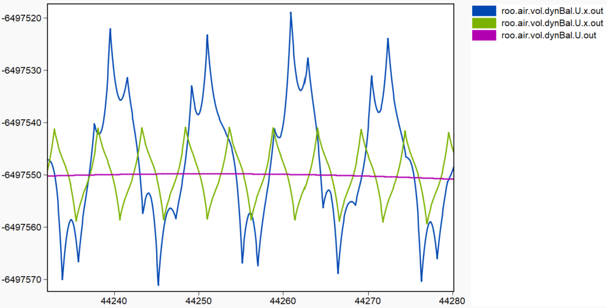

## Agenda: 2024/11/14
- QSS paper draft review/discussion
  - Should all examples go to the Appendix for now?
- Knock-On Zero Crossings
  - Order in FMU event_indicators array ==? Order in XML (not order of EI variables)
  - QSS zero-crossing protocol refinement to detect and handle this

## Agenda: 2024/10/02
- QSS paper draft review/discussion
- QSS code updated with latest refinements

## Agenda: 2024/09/19
- Development
  - Focus has been on finishing relaxation refinements before moving to bigger ideas
  - Resolved slowdown with rQSS3 due to larger inflectionFrac2
  - Added x (broadcast continuous representation) builds and evaulated performance impact on Buildings models (earlier testing had shown benefits)
  - Latest stable code pushed to SOEP-QSS repo
  - Yoyoing detection and convergence refinements
  - Deactivation reset options balancing accuracy and performance
  - rQSS3 missing some zero crossings in Scalable model
- Testing
  - Benchmarking runs/comparisons with latest QSS code: No big changes
- In Progress
  - Info for CW on get_real call issue
  - Info on EI mode surprising impacts for CW
- Peer Review slides
- QSS paper draft review and generate list of possible topics

## Agenda: 2024/08/29
- Development
  - Need for get_real calls
    - Tried various approaches to limit when get_real calls needed
    - Effect not limited to directional derivative calls
    - Left it in for now after all set_real calls: 10-20% performance penalty
  - Deactivation reset at zero-crossing events
    - Makes sense since trajectory discontinuities can occur there
    - But can cause progress to stall
  - EI modes that shouldn't affect state trajectories do => Missing dependencies
  - Option to clip very small values/derivatives to zero and denormal flush to zero (ftz) added: Avoids meaningless steps for some models
  - Inflection point treatment refined for 3rd order solvers to separate treatment of 2nd derivative inflection points
  - Zero-crossing self "handler" efficient treatment
  - Misc efficiency refinements
- Testing
  - Recent Buildings library has more event indicators
  - Extra get_real calls cause a slowdown
  - The basic performance picture hasn't changed much: Need to start on some of the bigger ideas

## Agenda: 2024/06/18
- Modelon
  - Can get incorrect directional derivatives unless I make "get" calls on the variable's dependencies ("computational observees") after setting them
  - Hard to determine which "get" calls needed after "set": before directional derivatives only? Working on it...
  - No luck finding a small demo case yet
- QSS Development
  - Relaxation solver refinements to avoid chance of time step stalling scenario
  - Relaxation convergence logic experiments underway

## Agenda: 2024/06/03
- Modelon Topics
  - Event indicator dependencies clarifications (from email):
    - When <Dependencies> has one event indicator depending on another (ei2 -> ei1) that means that ei2's expression has all of the same (non-event indicator) dependencies as ei1, and not that ei2's expression contains variables modified when an ei1 zero-crossing event occurs. It appears that in this situation the (non-event indicator) dependencies of ei2 appear in the <Outputs> dependencies.
    - When the combination of <Dependencies> and <Outputs> dependencies shows an event indicator that no variable depends on or that only "passive" variables (which no "active" continuous state or other variable in their dependency sub-graphs) depends on it is safe for QSS to treat those event indicators as "passive" so that QSS doesn't waste time tracking and requantizing them.
    Some such event indicators are marked inAssert="true" but others that are inAssert="false", which I'm assuming means they may occur in noEvent contexts or only in expressions for output variables but that don't affect the solution trajectories. I can provide examples of these if that is helpful.
- QSS Performance Development
  - Some important but smaller potential refinements were made
  - Other behaviors observed were investigated and led to other refinements
  - Next stage (larger potential) revisions are starting
  - Very small trajectory values and derivatives occur in some models and can cause tiny QSS steps and simulations getting "stuck"
    - Enabled flushing denormal values to zero in build options and code ("precise" floating point model disables it)
    - Still a problem for small values that are bigger than denormals so added a clipping threhold (defaults to 1e-100 but can override with `--clip` option)
    - Root solver iteration logic was hardened against very small values
  - Some models miss events with the rQSS3 solvers: More investigation is needed to see if we are missing dependencies or it is inherent to QSS
    - Using a deactivation state reset on variables altered in a zero-crossing event (and their observers) corrects this but has a cost when not needed so a `--dtInfReset` flag was added for now
    - Using a max time step or the new max deactivation time step can also limit this issue
    - More testing will be needed to choose a best approach
  - Use of second order inflection point time steps in rQSS3 was seen to cause overly small steps so a higher threhold for using these was added
  - For some models QSS spends a lot of work tracking event indicators that don't affect solutions
    - Added the `--EI` option that can disable tracking of these types of event indicators:
      - Event indicators that have no effect on solutions (such as those appearing only in asserts): Turning these off prevents detection of violations of those asserts
      - Event indicators that have no "computational" observers so can only affect (non-state) output only variables: Outputs of such variables would be incorrect and should be disabled
  - Zero crossing event logic refined to avoid "handler" processing of self-observing zero-crossing variables, which act as a conditional event signaling mechanism
  - Changed dependency processing logic to ignore EI->EI in `<Dependencies>` on the assumption that these are not actually short-circuited "handler" dependencies but just used when the zero-crossing functions are similar (the EI dependencies in `<Outputs>` show the actual dependencies are QSS currently merges those in)
    - Email to Christian identifies clarifications needed to confirm this approach is OK
  - Relaxation solver time step growth damping was refined to not include the effect of inflection point step limiting
- Testing
  - `run_PyFMI.py` updated to apply `maxh` for RodasODE and LSODAR (which use `maxh` but the OCT docs don't note that)
  - Scalable 1x1: (show plots)
    - rQSS2 is ~2.7X faster than prior version with these smaller refinements
    - Should be within ~4X of CVode for the larger Scalable models so we need another big jump forward

## Agenda: 2024/04/18
- Benchmarking
  - Added benchmarks repository git revision to plot footers
  - Verified that IntegratorWithReset CPU time doesn't start to look linear-ish until stopTime > ~100s: Reran benchmarks and they make sense now
  - 1-week simulations run times are too long for practical benchmarking: Improving QSS handling of derivative sensitivity will help but the CVode runs also get very slow as _n_ increases
- Development
  - Exploring LIQSS+clustering
    - Motivation:
      - ConservationEquationStep shows yoyoing but LIQSS solvers work on it because the stiffness is diagonal:
      - Forcing QSS to behave like a traditional solver with a fixed time step (setting dtMin=dtMax) has a controlling effect on the stiffness
      - "Modified LIQSS" paper that proposes a method for pairwise off-diagonal stiffness: we can try it and we may be able to generalize to _n_-ary off-diagonal stiffness
    - Added cluster file support to specify "clusters" of variables that should always be requantized simultaneously
      - We would find the clusters automatically _via_ Jacobian analysis for production use
    - Want to see what the effect is on time step size with all variants of the QSS and LIQSS solvers
    - Testing with Case600 since it has a modest number (41) of continuous states

## Agenda: 2024/04/04
- Benchmarking
  - Save and plot both total and simulation CPU time to clarify what we are measuring with the runs
  - Separate config.yml files for each benchmarking model set up and run with different scaling and `stopTime` to see what the largest `n` we can build each with and how small a `stopTime` we can use and still get useful scaling information
    - OneFloor_OneZone builds fail by `n=16`
  - To investigate behavior for the benchmarking models I set up a way to run them stand-alone so I can save the output and log files:
    - Added a `--parameter` option to `bld_fmu.py` to pass the scaling parameter to the FMU compilation
    - Added searching up the directory tree for the FMU to my `run_PyFMI.py` and `run_QSS.py` scripts to support saving different scaling/parameter/other FMU variants under the same model tree
  - Looking into suprising behavior with scaling
    - OneFloor_OneZone: Going from `nFlo=1` to `nFlo=2` the number of event indicators goes from 48 to 174 and the CVode run time goes from 52 s to 793 s
      - `nFlo=2` ~doubles the model size but the number of `cas` entries also doubles (?)
      - Maybe we want an option to not use the grid of duplicate models when the parameter itself changes the model size (Scalable also) (?)
  - Results repository created at https://github.com/DeadParrot/benchmark_results has some placeholder/preliminary results
  - Trying 1-week runs to see which models are fast enough to generate useful scalability curves
- OCT
  - Passing a model name with a parameter spec, like _model_(_var_=_val_), causes the `DefaultExperiment` section to be omitted. Bug?
  - Model size compilation limits wrt JVM use and/or generated C code size may be too low for SOEP
    - How to establish the needed size?
    - Can compilation be changed to reduce the JVM resource use and size of generated C?
- QSS
  - Added QSS startup processing CPU and wall time tracking to help with the planned work to reduce that
  - Working on getting better rQSS3 solver algorithm
  - Working on ideas for next phase of relaxation/stiff solvers

## Agenda: 2024/03/14
- QSS Development
  - Rename options: --tEnd -> --tStart  and  --tBeg -> --tStop
  - Updates for Linux
- getQSS.py
  - Clones SOEP-QSS to current or specified directory
  - Can choose a revision
  - Builds with GCC or specified compiler (defaults to release build)
  - Can suppress build with `--no-bld`
  - Builds attempt to set up environment for the compiler: Can fail if not found: Let me know and I'll adapt it to your systems
  - Builds require GNU make and (for FMIL) CMake
  - Requires GitPython package
  - Pushed to SOEP-QSS-Test/bin
  - Not currently integrated into benchmarking:
    - Usually will build once and benchmark multiple times.
    - Development build with some compilers (_e.g._, oneAPI) requires compiler environment but Python can't modify parent environment.
    - Production release builds will bundle necessary compiler shared/dynamic libraries.
    - For benchmarking you can add the QSS executable directory to `PATH` or use the SOEP-QSS `setQSS` mechanism to do that.
- Linux (Ubuntu 22.04):
  - OCT installed/tested
  - QSS built/tested with GCC, Clang, and latest Intel oneAPI C++ (including googletest unit tests verification)
  - Refined compiler build support
  - Experiment with parallel Observers: Results similar to Windows
  - Verify that QSS branch of benchmarking system works
- Benchmarking Development (QSS Branch)
  - Adapting YAML configuration file layout and code for:
    - Separate build config (parameter name/values) from simulation options to simplify FMU reuse logic and option hierarchy/overrides
    - Separate tool (Optimica, QSS) from solver (CVode, QSS3, ...) to simplify code
    - Support QSS option pass-through for any option without changing benchmarking code
    - YAML changes are not in QSS branch yet
  - Limitation: Can't run the same model+solver with different options in a given run because the solver list is separate from the per-model options specs. This is probably OK given expected usage of the benchmarking.
- Benchmarking Issues
  - Seeing very high JVM memory use for some models as we try to scale them up:
    - OneFloor_OneZone fails for n=16+ with JVM getting `-Xmx48g` (48GB)
  - GCC is failing to compile some FMUs as n increases looks like some C sources are too large
    - Tried to swap in a newer TDM-GCC on Windows without success
  - Specifying Visual C++ (`--msvs`) for FMU builds is failing within the benchmarking environment but works for stand-alone FMU builds (seems to not be using the model directory on `%TEMP%`)
- Benchmarking Runs
  - Configuration is now working for setting up and running the models with different parameter (sizing) values
  - Results for the non-trivial models show QSS input processing time is dominating for larger models
    - This should be greatly reduced by efficient graph processing algorithms and an option for minimal log output (FY24 task)
    - Added the `--sim-time` option to plot the simulation instead of total time
  - See the expected QSS derivative sensitivity effects with Buildings models that needs further improvement

## Agenda: 2024/02/29
- Benchmarking
  - QSS branch refinements
    - Reorder simulations to reuse prior FMUs when possible
    - Use separate FMUs for QSS runs since QSS FMU build options tend to slow PyFMI runs
    - Use sim and bld config dictionaries to simplify FMU reuse and adding more simulation options in the future
    - Support tool config settings that can be overridden for specific solvers
    - Show OCT and QSS versions in plots
    - Will merge into main branch after Linux testing (and any feedback)
  - getQSS.py script developed for use (?) by benchmarking
    - Stock QSS repo may not work for all users so hard to automate builds reliably
      - Compilers/Python/googletest: location, version, etc. (more an issue on Windows)
        - Some compilers can't build FMIL so depend on a 2nd compiler
      - googletest must be built/installed to run unit tests
    - Still a useful script for getting users started
- Development
  - Integrate FMIL into QSS repo/builds
  - Clang support on Windows added
  - Intel oneAPI support on Linux added
  - Prune out currently unused capabilities: FMU-QSS, PyQSS, ...
  - Linux support tested/debugged
  - Added `--tBeg` option to change start time (for benchmarking)
  - Git repo hash added to QSS version string (helps with saved benchmarking results)
- OCT
  - Installed OCT 1.48 release on Windows and Linux
    - Windows: Working fine
    - Ubuntu 22.04:
      - Tried to use a Python 3.10 venv but getting "bad magic number" from the OCT .pyc files so I'll switch to Python 3.9
      - Any reason I can't build the venv from Ubuntu's Python 3.9 rather than building 3.9 from source?

## Agenda: 2024/02/01
- Benchmarking
  - Initial QSS + Windows support put on a `QSS` branch with some small fixes and refinements
    - Tool lookup in tool_configuration logic fix and use "Optimica" instead of "optimica" as tool name (lookup is case sensitive)
    - Support reusing a prior Buildings 10.0.0 installation in `dst`
  - Issues/Decisions
    - Build sep FMU for QSS with QSS options?
      - Can be slow for larger models
      - Don't see the QSS support options slowing PyFMI runs noticably
      - Will want to refactor runSuite.py to separate PyFMI FMU build and simulation functions
    - User may have to install some packages into OCT Python for runSuite.py (yaml, shutil, zipfile, ...)
  - Features?
    - Add automatic QSS download/build support?
    - OCT and QSS version tagging in results/plots
- Development (not all of this is in SOEP-QSS yet)
  - Relaxation QSS3 experiments/refinements:
    - Try $\dddot{x}$ relaxation only (no $\ddot{x}$ relaxation) to avoid simultaneous requantization sequence dependency issues due to ND
    - No rQSS3 variations are performing particularly well yet: the 3rd derivative makes derivative relaxation trickier
  - Add relaxation => inflection
  - QSS3: Use inflection points at $\dot{x}=0$ as well as $\ddot{x}=0$
  - Make dtND optimization the default if `--dtND` specified without a value

## Agenda: 2024/01/08
- Development
  - List of QSS solvers added to SOEP-QSS repository README
  - Relaxation testing/refinements
  - Parallelization testing/refinements
  - Numerical differentiation time step optimizer improved
  - Next phase of relaxation convergence work in progress
- Benchmarking
  - Ported `runSuite.py` to work on Windows:
    - Path separators
    - `%TEMP%` _vs._ `/tmp`
    - `process_time()` to `perf_counter()` to get subprocess CPU time on Windows (should work on Linux)
    - _etc._
  - Working on integrating QSS support: Non-trivial
  - Issues
    - QSS doesn't generate `.mat` files yet: Do we need it to output ASCII signal files?
    - Requires Buildings Library 10.0.0
      - Can it be adapted to work with other versions?
      - Number of event indicators increased => may impact QSS performance
      - Can't use with May 2023 Buildings lib I've been using: Models use `Buildings.Controls.OBC.CDL.Reals`
    - `Case960` giving: `Radau5 failed with flag -8. At time 237157.572000. Message: Repeated unexpected step rejections`
    - `DualFanDualDuct`: Radau5 failed with flag -5. At time 5.610175. Message: Maximal number of steps = 100000 exceeded
    - Getting `timed out after 600 seconds` for CVode runs of `DataCenterDiscreteTimeControl` and `Guideline36` and `DualFanDualDuct`
    - Still getting `USA_CO_Denver.Intl.AP.725650_TMY3.mos - The process cannot access the file because it is being used by another process` (during output processing)
    - Parameters in supplied `configuration.yml` see to be too small to see scalability (or `time.perf_counter()` is still not measuring subprocess CPU time?)
  - Ideas
    - Option to name results directory (automatically?) to avoid overwriting so we can run different benchmarks at the same time
      - Could use the `.yml` config file to select a default name

## Agenda: 2023/12/21
- Benchmarking
  - (Michael): Set up for benchmark problems.
- Development
  - LIQSS variants added: full-order propagation, interpolation (reduce DD calls), DD2 & ND2
    - Don't expect to keep all of these but want them for further testing
    - So far the interpolation approach seems faster at no significant accuracy loss
  - LIQSS simultaneous requantization q_0 value update deferral dropped: sequence-independence benefit did not dominate benefit of fresher trajectory
  - Parallelization
    - Not a lot of potential
      - Run time is spent almost completely within the FMU
      - We gain speed by making fewer and more efficient use of the FMI API (and any future speedups within the FMU for QSS atomic/sparse operations)
    - Parallel (OpenMP) Observers added: Extends earlier approach and exploits recent refinements/simplifications
    - Still doesn't beat serial until the number of observers gets quite large (>100) so it was implemented with a low-impact chunk size check & forking to the serial code (for minimal impact when not active)
  - Determinism: Copy trigger vector to sort it for search efficiency (when large enough vector)
  - Unit test updates for these changes
- Performance Testing
  - QSS is ~30% faster than a year ago due to more FMU call pooling, removal of mixed-order solver support, passive variable treatment, ...
- Now: Finishing FY23 contract tasks and working on relaxation
- Next
  - Further work on relaxation: detection during observer update sequences, 3rd order algorithm, ...
  - Try mLIQSS (maybe extend to >2 coupled variables)
  - Consider mixed CVode+QSS algorithm

## Agenda: 2023/10/05
- Relaxation QSS3
  - Adds 6 solvers for QSS3 and LIQSS3 with D2D, N2D, and with full order representation broadcasting
  - Best relaxation factors to use for $\ddot{x}$ and $\dddot{x}$ ?
  - Inflection points only where $\ddot{x} == 0$ or also where $\dot{x} == 0$ ? Testing says we want both but $\dot{x} == 0$ costs an extra quadratic solution
- Final Convergence Smoothing
  - Detect convergence: Heuristic
    - Converging objects:
      - Keep running low-pass filtered derivative
      - Metric to assess when within convergence band
    - In converged mode trying different multipoint representations
  - Don't have a robust solution yet

## Agenda: 2023/8/24
- Go-NoGo Slides
- Directional State 2nd Derivatives
  - Can be much slower for dense dependency graph models such as ObserversN (fully-connected)
    - Binning greatly reduces the slowdown
  - For now bringing pure ND solvers back as nQSS2/3 options (but with some of the call pooling and other recent improvements)
  - Should be able to add warnings for runs where the ND solvers may be more efficient once more experimentation is complete
  - Is there room to improve DD efficiency?
- Other Development
  - Completed FMU call pooling changes for setting the FMU values of observee collections
  - Eliminated support for mixed QSS solver order runs => Smaller and more efficient code
  - Custom FMIL build options gave a small speedup but LTO trials didn't yield benefits
  - VTune profiling of D2D runs confirmed DD overhead dominates but didn't point to useful QSS hot spots to tune
- Next:
  - Converged relaxation solver trajectory smoothing for larger steps
  - LIQSS2/3 interpolation option to reduce the number of extra DD calls

## Agenda: 2023/8/10
- Directional State 2nd Derivatives
  - Development
    - Completed with additional refinements: Not pushed to SOEP-QSS repo yet
    - Significant code simplification: Only state ND is 1 level in QSS3 solvers
    - Reduces order dependencies
  - Testing/Findings
    - QSS2: Accuracy ~same | ~25% faster than ND
    - QSS3:
      - AchillesN (All ops simultaneous): ~5X better accuracy and ~40% faster than ND
      - Case600: ~25% fewer steps and ~40% faster => QSS3 is more practical without 2-level ND noise
        
    - LIQSS3:
      - SLOW! ~3X slower than ND
      - Needs 4 DD calls for each variable (LIQSS2 only needs 2 and DD is ~28% faster than ND)
      - LIQSS is not amenable to the FMU call pooling that is key for QSS over FMU performance
      - May keep separate ND and DD LIQSS3 variants for now and consider alternatives later

## Agenda: 2023/7/26
- Testing
  - Scalable
    - Newer 12th Gen Alder Lake system with P+E cores giving strange/inconsistent CPU timing: No solution found yet
    - Ran all models up to 10x10 on an older system (without het. CPUs): QSS performance is a bit worse rel to CVode
    - 10x10 isn't large enough to hit CPU speed parity with CVode with current relaxation QSS2
    - 12x12 and larger won't build with OPT MinGW on Windows currently
    - QSS areas of improvement:
      - Profiling/tuning and parallelization and more FMU call pooling
      - Directional 2nd state derivatives => Enable QSS3 use (need to developed relaxation QSS3)
      - Trajectory damping to allow larger steps when relaxation has converged on precise trajectory
      - Explore use of multi-point integrator when converged
  - Ptolemy: ConservationEquationStep model ported for QSS comparison:
    - Need some work to get the two models to be running the same thing (tEnd, rTol, aTol, variable correspondence, ...)
    - Not sure how to get sampled output for good trajectory visualization or step/requantization count
    - Ptolemy has a few QSS2 variations wrt ND time step selection: Fd is probably closest to QSS2 (?)
      - These methods might be worth exploring for SOEP QSS ND step selection but uniform ND step at each event is needed for efficient call pooling
    - Preliminary results:
      - Ptolemy plot of t_Xi1 (matches Modelica model dynBal.medium.Xi[1]) at the same RMS shows noise but doesn't have enough output points to see if it is yo-yoing
        
      - At the same RMS accuracy SOEP QSS2 (standard and relaxed) use fewer steps than Ptolemy QSS2Pts (187 and 97 vs 2696)
        - Not sure the data.txt lines give the Ptolemy requantization count
    - This model is not highly sensitive so maybe not a perfect sanity check but QSS2 does do some yo-yoing with it
- Development
  - State directional 2nd derivatives
    - Seems to work well for QSS2 single and simultaneous requantizations: No performance hit (actually seeing a 20-25% speedup)
    - Completed migration for all QSS2 solver variants and Observers, Triggers, and Handlers collections for simultaneous events
    - Extending to QSS3 now
    - Next:
      - Extend to QSS3 and evaluate on some models
      - Remove obsolete ND code
      - Simplify code (probably including dropping ability to use per-variable solver orders)
      - More FMU call pooling for fmu_set operations and LIQSS where practical
      - Profiling/tuning and parallelization
  - Next: Trajectory damping and/or multi-point approaches to get large steps when relaxation has converged trajectory

## Agenda: 2023/7/12
- Testing
  - Scalable: F Floors x Z Zones/Floor
    - Ran 1x1, 2x2, 4x4, and 8x8 "diagonal" models
    - Not particularly sparse models
      - Many variables have 300+ observers/observees in the 8x8 version (which has 1845 continuous state variables)
      - Perform worse with QSS than most Buildings models
    - Using total number of zones as the model "size" for scalability comparisons
    - Relaxed QSS2 brings trajectory in nicely but still has a lot of noisy, small steps near precise trajectory: this should be something we can reduce significantly
      
    - First "clustering" try (requantizing all states in a state's self-dependency cycles when it requantizes) did not give significant improvement: may still be worth further thought/trials
    - Relaxed QSS2 CPU ratio compared with CVode goes from an awful 145X slower in the 1x1 model (stock QSS2 is >5000X slower) down to 11X slower in the 8x8 model
    - QSS scalability advantage is seen but we need to clean up the small steps to overtake CVode at more modest model sizes
      
      
  - MixingVolumeMassFlow
    - Suggested as a simple model we could implement in Ptolemy to compare to the SOEP-QSS implementation if it has
    - This simple model _doesn't_ demonstrate the derivative self-dependency sensitivity (yo-yoing)
    - [At the same accuracy QSS2 is actually 2.3X faster than CVode]
    - Maybe the ConservationEquationStep or some other simple model with the issue could implemented in Ptolemy instead
- Development
  - Working on state directional 2nd derivatives: this is a fairly involved task that affects a lot of code
  - Exploring ideas for smoothing the converged trajectories

## Agenda: 2023/6/20
- Testing
  - Verified that OCT-master-8bb4688ea939e98a3f23be67236795ab5f2d3ac4 fixes `reinint` + `pre` problem and closed that Issue.
  - Set up for Scalable model testing at different sizes.
  - Performance of Buildings models including Scalable are much improved with relaxation but not competitive with CVode (to varying degrees)
- Development.
  - Could explore multipoint smoothing to improve relaxation but it isn't trivial to combine with QSS.
  - Focusing on requantization "clustering" first to see if that can help with sensitivity. Trying self-dependency loops as the first idea.
  - Next will be directional second derivatives to enable QSS3 (larger steps).
- Papers of Interest
  - QSS researchers are writing about QSS modifications that show they are also hitting models where it doesn't perform well.
  - [Mixed–Mode State–Time Discretization in ODE Numerical Integration](https://www.researchgate.net/publication/340495790_Mixed-mode_state-time_discretization_in_ODE_numerical_integration): Combining LIQSS with CVode
    - "The proposed mixed–mode scheme consists of splitting an ODE, using QSS algorithms where they perform better than classic algorithms (i.e., in presence of frequent discontinuities or stiffness under certain particular sparse structures) and using classic algorithms where they are a better choice"
  - [DEVS Simulation of Marginally Stable Systems](https://citeseerx.ist.psu.edu/viewdoc/download?doi=10.1.1.61.5329&rep=rep1&type=pdf)

## Agenda: 2023/6/2
- Relaxation Development
  - Relaxed LIQSS2 (rLIQSS2)
    - Completed and tested a few variations including with and without $\ddot{x}$ relaxation
    - Performance is not as good as relaxed QSS2
    - Investigating stiffness structure to see if off-diagonal contributions are large in Buildings models
- Testing
  - Case600 and ASHRAE2006 relaxation trials and analysis run to look for candidates for additional performance gains
  - Seeing solution mis-tracking in ASHRAE2006 that may be due to sensitivity to the slightly stale trajectories of non-requantizing variables or possibly missing dependencies
- OCT
  - Time frame for OCT update with reinit/pre dependency support?
  - Ideas for non-event-generating operations (min/max/...) and calls within function (FunctionTest)?
- Next
  - rLIQSS2 variations/testing
  - Stiffness structure analysis to see if that explains rLIQSS2 performance
  - Guideline36 and scalable model testing with best rQSS2 variant
  - State $\ddot{x}$ directional derivatives development and [r]LI/QSS3 development exploiting this

## Agenda: 2023/5/22
- Development
  - Refined relaxed rQSS2 for performance: sensitivity detection and relaxation enabling, time step controls (inflection points, growth damping), $\ddot{x}$ relaxation, ...
  - Reenabled xQSS variants and added rxQSS2
  - Experimented with "convergence" controls to reduce steps once relaxation trajectory converges on precise trajectory: nothing clean enough that works well found yet: will give it more thought
- Testing
  - Case600
    - Comparing RMS-matched (QSS is more accurate with the same `rTol`) 1-day runs
    - Current rQSS2 and/or rxQSS2 are approaching 3X faster than stock QSS2 but still 4+X slower than CVode (ncp=0) runs
    - Hope to further reduce steps after trajectory "convergence"
    - Not large or sparse enough model for QSS to shine but can probably get to ~2X CVode speed after next phase
- Next
  - Complete rLIQSS2 and do basic performance comparison
  - Performance testing rQSS2 and rLIQSS2 on larger/scalable Buildings models to see where we are at
  - Revamp with state $\ddot{x}$ directional derivatives
    - Reduce QSS order dependencies
    - Reduce trajectory noise causing extra steps
    - Enable practical QSS3
    - Fairly involved change: will take at least a few days to complete
    - Test standard and relaxed QSS2 and QSS3
  - "Clustering" support to reduce QSS sensitivity and experiment with logic for automating minimal clustering
  - Performance:
    - Profiling/tuning
    - Parallelization
    - Output logic revamp to handle local variables (with or without dependencies) more efficiently
    - Option for full in-memory output buffering to minimize i/o during simulation
- OCT
  - Dependency problems in Issues that have no work-around and may impact Buildings model testing
    - reinit: https://github.com/NREL/SOEP-QSS-Test/issues/30#issuecomment-1536951802
    - `<Dependencies>` missing and short-circuited dependencies (include local variables)
      - Harvesting dependencies from `<ModelStructure>` as work-around
      - Can't experiment with "active" signaling variables that are short-circuited for update "firewalling"
  - Start value issues (email discussion)
  - Think about providing event indicator derivative variables so they track with states

## Agenda: 2023/5/3
- Relaxation:
  - Coordinated (geometric) $\dot{x}$ and $\ddot{x}$ relaxation can be done but is complex and expensive.
  - Experimented with a simple approach: inflection point time step shortening and damped time step lengthening. This doesn't require yo-yo detection and could be fast enough to leave on all the time in unified QSS variable types.
    - Inflection points can add more steps when not needed so may not be viable without yo-yo detection/enabling
    - Inflection point control seems to be needed to avoid near-zero steps: _e.g._, skip inflection point if time step would be < 1% of the natural QSS time step
  - Time step growth relaxation: Only apply if no inflection point used?
  - Experimented with $\ddot{x}$ relaxation: using half the QSS $\ddot{x}$ value (and keeping the QSS $\dot{x}$) has the trajectory hitting the halway point between the $x$ and $q$ trajectories at the next QSS time step, which is about where the precise trajectory typically sits when sensitive yo-yoing occurs. This is effective and allows longer steps during convergence to precise trajectory but still benefits from inflection point time step shortening. Given that it requires yo-yoing detection (and could give a bad trajectory if detection was wrong) sticking with time step only relaxation seems safer and probably more efficient overall.
  - Case600:
    - Time step + $\ddot{x}$ relaxation looks like a good approach for `dp`: start to get large time steps.
    - `T_degC` (self-dependent) still has high step count with this relaxation.
      - Suspect sensitivity to use of trajectory values from other non-requantizing observee variables.
      - Continuous (instead of quantized) trajectory propagation reduces sensitivity noise.
      - Fixed time step QSS runs (dtMin==dtMax==2) clean this up.
      - Concept of a requantization variable bin could be key. Needs to happen automatically and bins need to be minimal to avoid losing QSS sparsity benefits.
  - Impact of continuous trajectory propagation.
- Performance:
  - Assessment: Metrics _vs._ reference solution is tricky:
    - Same CVode and QSS tolerances don't give same solution accuracy so we need to tune the tolerance of one of them to compare time steps and run time.
    - Non-uniform time sampling of PyFMI (to prevent forcing extra integration points):
      - QSS runs can add sampling points without causing integration steps but we want a comparable metric.
      - Need very high sampling rate in reference solution or metric can be dominated by interpolation "error".
      - Need to measure "error" only at non-reference points to avoid large interpolation "errors" (simdiff --coarse).
      - Should we be weighting the diffs by the time step size for a uniform metric?
- Other:
  - Build system revamp: Drop `64` directory level, refine compiler options, ...
  - Linux (Ubuntu) testing/updates, build FMIL 2.4.1 and migrate
  - OpenMP experiments with new Clang-based Intel oneAPI C++

## Agenda: 2023/4/4
- Relaxation Development:
  - Time step based relaxation is workable and fairly efficient.
    - Derivative relaxation adds a lot of logic complexity/hueristics and overhead (I am still experimenting with this further to be sure).
  - Best approach so far uses a 3-level logic when relaxation is needed:
    1. Limit time step to the $x$ inflection ($\dot{x} == 0$ in QSS2) point if one is present at a positive step. In QSS2 this is also the point where the $x$ trajectory change from the requantization value is half the $q$ trajectory change.
    2. Otherwise limit the time step to the point where the $x$ derivative equals the estimated boundary derivative at the requantization point ($\tilde{\dot{x}} = ( \dot{x}^- + \dot{x}^+ )/2$) if such a point exists at a positive time step.
    3. Otherwise, if small "yo-yoing" metric indicates likely close to precise trajectory, limit time step to a growth factor from prior step. This allows time step to grow flexibly while staying close to the precise trajectory without needing a `dtInf` or `dtMax` control.
  - This may be automatable and efficient enough to allow its use in default state variable types but for now developing them as option-enabled alternative types
- Relaxation Testing:
  - ConservationEquationStep: Pulls QSS2 trajectory in to reference trajectory efficiently and then enables large steps.
    - Converged behavior can probably be improved, possibly with derivative relaxation.
  - Case600: Need to enable yo-yo metric detection to avoid slowing non-yo-yoing variables.
- Next Steps:
  - Finalize QSS2 relaxation and see if it is fast and automatic enough to merge into primary state variable types.
  - Develop QSS3 relaxation on analogous principles.
  - Profile/tune/parallelize.
  - Performance testing.

## Agenda: 2023/3/27
- QSS Development
  - Time step history output added: Actual steps at requantizations (not initial predicted and not observer steps. Informative for variables that dominate the requantizations.
  - Dependency management fixes.
  - Added --dot option to request Graphviz dot output files: These get too large to be practical for other than fairly small models.
  - Support .var file entries overriding default output filtering (so, e.g., you can get time signal output)
  - Made Computational Observers/Observees listing on all the time.
  - Changed dependency harvesting from `<ModelStructure>` to skip `<InitialUnknowns>`: Initialization dependencies shouldn't matter for QSS.
  - Support --out+<flags> and --out-<flags> to simplify output selection/overrides.
  - OCT 1.4.0 install/testing
    - Small differences from previous OCT update.
    - SimpleHouseDiscreteTime:
      - time initial value issue remains.
      - Number of event indicators went from 13 back to 12.
  - FMIL 2.4.1 build/mig/test. Posted two GitHub issues.
  - gtest 1.13.0 build/mig/test.
- SimpleHouseDiscreteTime Study
  - Newer revisions that add dependencies from `<ModelStructure>` catch a number of missing dependencies in `<Dependencies>`.
    The prior simulation was generally OK but some event indicators had no/missing dependencies so were wrong.
    Enough added dependencies to slow simulation => Important to eliminate extraneous dependencies.
  - time variable initialization issue noted in email: Added temporary work-around to use XML initial time value when they disagree.
- Relaxation
  - Michael is thinking about a small model that would demonstrate the dynBal.m sensitivity
  - Michael suggests looking at analytical derivative expression if the derivative approx is contributing to the sensitivity. I suspect that QSS is getting pretty good derivatives and the analytical would be similar but there is some extra noise due to ND that analytical or directional derivative should eliminate.
  - Did a deeper analysis of the relaxation metrics, estimates, and algorithms that gives good direction for the next round of refinements:
    - Idea for geometric approach to relaxing $\dot{x}$ and $\ddot{x}$ together that should avoid issues with derivative sign changes without requiring conditional logic.
    - Will also be trying a cleaner method for time step only relaxation since this could have a number of simplicity and performance advantages.
    - Should have both of these working within a few days and will report on progress.

## Agenda: 2023/3/13
- Relaxation QSS: Theory/Framework Development
  - Want simplest possible approach that is robust and self-controlling => Not too many independent controls
  - Relationship between $\dot{x}$ and $\ddot{x}$ relaxation and time step relaxation
  - Relaxation by magnitude _vs_ toward estimates
  - Moving average estimates to avoid chasing noise _vs_ gradual relaxation changes and relaxation limits
- Status
  - $\dot{x}$ relaxation along with $\ddot{x}$ and time step relaxation => Improves efficiency of converging on precise trajectory
  - conHea.I.y and conCoo.I.y are now driving more requantizations than roo.air.vol.dynBal.m: Look into making relaxation work better for them
- Plans
  - Try refinements of relaxation factor control logic
  - Try moving average $\dot{x}$ and $\ddot{x}$ trajectory boundary based estimates (to damp noise and distortion of trajectory convergence)
  - Use $\dot{x}$ nominal value instead of estimate for sensitivity metric to avoid need for both relative and absolute criteria to handle estimate approaching zero

## Agenda: 2023/2/27
- Relaxation/Multistep QSS Development
  - Goals
    - Efficient QSS algorithm adaptation that brings trajectories close enough to precise trajectory to allow safe large steps
    - Gradual and automatic trajectory correction
    - Ideally, fast enough that no user option required
  - Metrics for detecting/measuring variable sensitivity
    - Multistep $\dot{x}$ and $\ddot{x}$ estimates across requantization points
    - $\dot{x}$ and $\ddot{x}$ estimates from average of incoming and outgoing $\dot{x}$ at requantizations
    - ???
  - QSS2 algorithm adaptations evaluated
    - Shorten ("relax") time step to stop trajectory from traveling back out to Q-tolerance away from precise trajectory
      - Gradual relaxation so metrics are good enough
      - This can bring trajectory close to precise but $\dot{x}$ and $\ddot{x}$ remain large enough to limit step size
      - Got just modest step count reductions
    - Added $\ddot{x}$ relaxation
      - Improvement but $\dot{x}$ relaxation is still needed near precise trajectory to get to large steps
  - Conclusions
    - Don't yet have a clear best algorithm
    - Complex due to multiple, interacting relaxation factors
    - Adding $\dot{x}$ relaxation should get us the desired large steps

## Agenda: 2023/1/30
- Development
  - Harvest additional dependencies from `<ModelStructure>` to work around `<Dependencies>` issues
  - Special time variable that never requantizes to enable QSS1 testing without time requantizing and more efficiency for QSS2/3
  - Archive deferred-updating variable experiment due to poor performance
- Testing: Case600 roo.air.vol.dynBal.m is a good demo for the key performance issue for QSS on Buildings models
  - Self-dependent variable based on small differences between large values
  - Derivative gets very large at small offsets from exact solution => QSS2 solution "yo-yos" between Q-tolerance bracket around solution
    - The solver trajectory must quickly converge toward the exact solution to get close to its actual derivatives and allow large steps
    - Pure QSS trajectories evaluate at Q-tolerance boundary so they can't do this
  - Models may also be stiff but LIQSS alone doesn't overcome small step behavior caused by this derivative sensitivity
  - IBPSASync_issue1412_stateSelect_Tp Buildings branch is numerically better but doesn't eliminate the issue: QSS2 tracks the reference solution 3X better but still yo-yos
- Relaxation/Multistep QSS
  - Experimented with $\dot{x}$ and $\ddot{x}$ relaxation: Can increase step but not smooth convergence with this alone due to requantization still happening at Q-tolerance border
  - Inflection point option shows desired behavior on constant sections
  - Now looking at approaches to blending previous 3|4-point based $\dot{x}$ and $\ddot{x}$ with QSS 1-point values
  - Goal: efficient and smooth blend of QSS and multi-step trajectories to bring trajectory to exact solution
  - Develop a rationale for shortening these long steps to keep requantizations near enough to exact solution

## Agenda: 2022/12/15
- Development
  - Self-dependent event indicator variable fix to prevent resetting the zero-crossing event time on detected crossings
  - Continuous state variable deferred requantization and handler updates to remove ND-caused order dependency in QSS2+ in non-simultaneous events with self-dependency
  - LIQSS updates in progress to streamline code and eliminate more ND-caused order dependency
  - Initialization changes being evaluated to bootstrap initial state without ND-caused order dependencies and using refinement to get accurate higher order coefficients
- Testing
  - Guideline36: Behavior is believed to be representative of issues seen with other Buildings models
    - Early mis-tracking traced to event indicators with the same C1_flow * C2_flow we have run into before
      - C2_flow is mis-tracking -> states such as hvac.cooCoi.heaCooHum_u.vol.dynBal.m that are self-dependent and have tiny changes in early phase
      - QSS gets off track slightly and then worse => Probable numerical/stiffness issues
      - With dtMax=1e-4 QSS tracks well
    - PyFMI Testing: Looked at early behavior with different solvers: Conclusion = Stiff solver needed
      - CVode
        - BDF (stiff): Tracks well
        - Adams (non-stiff): Mis-tracks
      - ExplicitEuler: Mis-tracks until `h` reduced to 1e-4
      - RungeKutta34: Mis-tracks
      - Dopri5: Mis-tracks until step reduced to 1e-3
      - Radau5ODE: Tracks well
      - LSODAR: Tracks well
    - QSS Testing: QSS2 for now: Will run LIQSS2 after in-progress changes
      - ND time step affects results but doesn't correct tracking for non-LIQSS methods
      - Adding --dep changes solution => May have missing dependency issues
- Next
  - Do LIQSS methods fix tracking? If stiffness is primarily "diagonal" then it should and we see issues with self-dependent states
  - If EI requantizations remain dominant consider smarter and more automated approaches to reducing them than `--zFac`
  - Get performance results once tracking is OK

## Agenda: 2022/12/08
- General
  - Added computational observer/observee Graphviz graph generation to the direct dependency graph (helpful for debugging)
  - Computational observer intialization sequencing bug fixed
  - Functions for deferred update ND use fixed
  - QSS set for now to do some things differently than before
    - Simultaneous updates of interdependent states do deferred updates rather than trying to use evolving new trajectories
      - ND time steps and LIQSS make doing this in a pure, order-independent way impossible short of requiring and exploiting a triangularizable dependency matrix
      - Other variable types (EIs and BIDR) could update after states and also use new trajectories but for now they don't for some notion of consistency: Easy to switch
      - Deferred updating => order independence at each phase => parallelizable: Not exploited yet
    - Continuous states propagate continuous (not quantized) representations to their observers unlike traditional ODE QSS
      - Other variable types naturally want continuous representations (observees appear in their value, not derivative) so this is more consistent and can enable greater operation pooling for efficiency
      - Could readily make switchable to quantized and compare behavior later
      - This separates the function of the quantized rep for choosing when to requantize from its use as the external representation
- Testing
  - Many of the smaller models tested and behavior verified
  - Added an ObserverGraph model to demo/test computational observers/observees
  - UpstreamSampler switch behavior resolved by QSS bug fix
  - Case600 & Case600FF: Buildings 9 versions give wrong QSS results: Non-SI units present: Investigating
  - Guideline36 & ASHRAE2006: Some event indicator 2nd derivatives are off: Investigating to isolate cause: Non-SI units present
  - Can non-SI units be a problem for QSS?
    - Are directional derivative seeds assumed to be in their own units or SI units or the target variable's units?
    - Can a continuous state and its derivative used inconsistent or SI and non-SI units? Does integrator have to convert?

## Agenda: 2022/11/30
- Revised QSS is working as hoped
  - Observees (for setting variable values in FMU) are short-circuited to states and inputs
  - Observers (for signaling updates) short-circuit around passive variables
  - Passive variables can be output via sampled output times
  - Event indicators can depend on other event indicators to handle passive variable short-circuiting (but prefer Dependencies not to s-c): OCT generates some of these
  - Discrete intermediate variables can be active (firewall) or passive (short-circuited via --passive): Can test to see whether active is worth it in most models
  - Updates flow through intermediate variables immediately for consistency
  - Working with current OCT dependencies (at some reduced efficiency)
  - Not performance optimized yet: A number of efficiency updates deferred
- Results
  - Feature test models are working with current OCT dependencies as planned: Can be more efficient with dependency changes
  - UpstreamSampler: QSS run seems OK (was broken with previous QSS) but CVode run doesn't show sampler activity! (Doesn't work with Buildings 9) No reference solution to check against
  - Need to change observer advance cascade calls to deal with circular dependencies to get larger models running efficiently
  - Don't know if (non-event-generating) min/max are an issue for some models
  - Need to look at handling of non-state real variables with associated derivative variables
- Issues
  - Event indicator to event indicator dependencies in modelDescription.xml are used in two different situations, which interferes with QSS's ability to patch around the lack of direct dependencies:
    1. An intermediate "signaling" variable modified in on EI block that appears in the other EI expression has been short-circuited out
    2. The EIs share an expression or dependencies
    - QSS temporary work-around: Adds dependencies for both meanings: inefficient
  - Simultaneous events prevent consistent (order-independent) updating with ND
    - Doing deferred updating of states for now to avoid this but is that ideal?
    - Event handler blocks are tricky:
      - State handlers with interdependencies: Capture FMU post-event states in deferred values before overwriting them to do QSS updates/ND
      - See my DepTestR_ss
      - ZC "handlers" are really conditional observers due to s-c, not handlers, so they should be using updated handler values
      - BIDR handlers could be processed after state handlers do deferred updates but should they?
    - Does FMU/PyFMI do sequential updating in such blocks? Depends on "triangular" dependency structure (excluding pre())?
      - If QSS needs to do this it would need to know what dependencies are from pre()
  - Trying x-based observee values for states
    - A bit more accurate but may cause more ND noise
    - Enables simpler/faster code since BIDR and ZC variables are naturally X based: Can fully exploit this if we decide to stay with X-based
  - Zero crossing protocol
    - Need to set handler observee state before FMU event processing to make sure it sees correct pre() values ?
    - If ZC event fires FMU actually sets handler state at t_bump, not tZ: Add post-event correction for this ? Pass t_bump also and have it back correct x_0_ to ZC(tZ) ?
- Proposed OCT/spec changes
  - Dependencies
    - Direct dependencies only: No short-circuiting. Handler dependencies don't "look through" event indicators to their dependencies
    - No extra dependencies (see Issues)
    - Include those for local variables if practical
